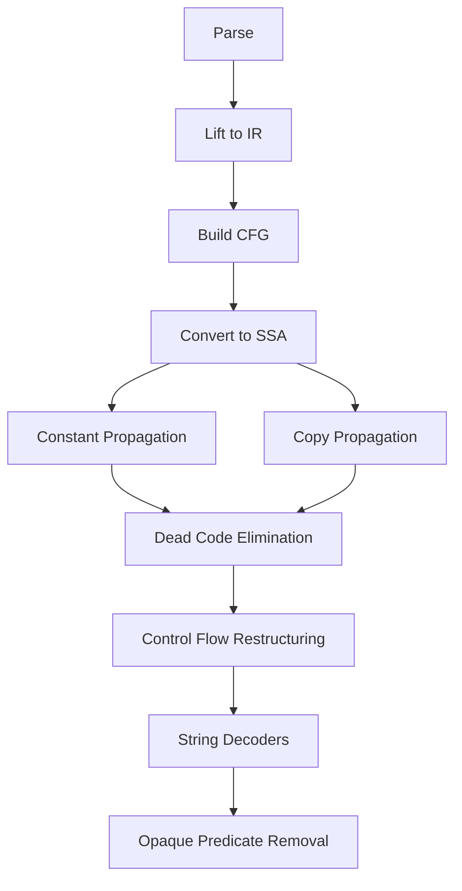

# ArachneJS Architecture Overview

**Understanding the technical architecture and design principles behind ArachneJS.**

## System Architecture

ArachneJS is built on a sophisticated multi-stage analysis pipeline that transforms obfuscated JavaScript through formal program analysis techniques.

```
┌─────────────────┐    ┌──────────────────┐    ┌─────────────────┐
│   Input JavaScript  │─→│   Parser & AST   │─→│  Intermediate   │
│   (Obfuscated)   │    │   Construction   │    │ Representation  │
└─────────────────┘    └──────────────────┘    └─────────────────┘
                                                          │
┌─────────────────┐    ┌──────────────────┐              │
│ Clean JavaScript│←─  │   Code Generator │←─────────────┘
│    (Output)     │    │   & Lowering     │
└─────────────────┘    └──────────────────┘
                                ↑
┌─────────────────┐    ┌──────────────────┐
│   Pass Manager  │─→  │ Optimization &   │
│  & Orchestration│    │ Analysis Passes  │
└─────────────────┘    └──────────────────┘
```

## Core Components

### 1. Frontend: Parsing and Lifting

**Location:** `src/lifters/`

The frontend converts JavaScript source code into an analyzable intermediate representation.

```typescript
// Parsing Pipeline
JavaScriptSource → AST → IR → CFG → SSA
```

**Key Components:**
- **AST Parser**: Acorn-based JavaScript parser with error recovery
- **IR Lifter**: Converts AST to intermediate representation nodes
- **CFG Builder**: Constructs control flow graphs
- **SSA Converter**: Transforms to static single assignment form

**Example IR Node:**
```typescript
interface IRNode {
  type: string;
  id: number;
  predecessors: number[];
  successors: number[];
  metadata: Map<string, any>;
}
```

### 2. Analysis Engine: Passes and Transformations

**Location:** `src/passes/`

The analysis engine applies various deobfuscation and optimization passes.

**Pass Categories:**

1. **Constant Propagation** (`constprop.ts`)
   - Replaces variables with their constant values
   - Handles string arrays and numeric computations

2. **Dead Code Elimination** (`dce.ts`)
   - Removes unreachable code and unused variables
   - Uses reachability analysis and use-def chains

3. **Control Flow Restructuring** (`deflatten.ts`)
   - Reconstructs natural control flow from flattened patterns
   - Identifies and eliminates dispatcher loops

4. **String Decoders** (`decoders.ts`)
   - Recognizes and evaluates string array patterns
   - Handles rotated, shuffled, and encoded arrays

5. **Opaque Predicate Removal** (`opaque.ts`)
   - Identifies conditions that always evaluate to true/false
   - Uses constraint solving for complex predicates

**Pass Interface:**
```typescript
abstract class Pass {
  abstract name: string;
  abstract run(ir: IR): boolean;
  abstract dependencies(): string[];
}
```

### 3. Constraint Solving Engine

**Location:** `src/passes/z3-solver.ts`

Advanced constraint solving using Z3 SMT solver for symbolic execution.

**Capabilities:**
- Path constraint analysis
- Symbolic variable solving
- Complex predicate evaluation
- Array index resolution

**Example Usage:**
```typescript
const solver = new Z3Solver();
solver.addConstraint(expr('x > 0'));
solver.addConstraint(expr('x < 10'));
const model = solver.solve();
// Returns: x = some_value in range (0, 10)
```

### 4. Sandboxed Execution Environment

**Location:** `src/sandbox/`

Safe execution environment with tracing and policy enforcement.

**Features:**
- **QuickJS Integration**: Lightweight JavaScript engine
- **Execution Tracing**: Records all operations and state changes
- **Resource Limits**: Memory, time, and operation constraints
- **Policy Enforcement**: Blocks dangerous operations

**Architecture:**
```
┌─────────────────┐    ┌──────────────────┐
│  Input Script   │─→  │   Sandbox VM     │
└─────────────────┘    │  ┌─────────────┐  │
                       │  │ QuickJS     │  │
                       │  │ Engine      │  │
                       │  └─────────────┘  │
                       │  ┌─────────────┐  │
                       │  │ Intercept   │  │
                       │  │ Layer       │  │
                       │  └─────────────┘  │
                       └──────────────────┘
                                │
                       ┌──────────────────┐
                       │  Trace & Policy  │
                       │   Enforcement    │
                       └──────────────────┘
```

### 5. Bytecode Analysis (Advanced)

**Location:** `src/lifters/quickjs/`, `src/lifters/v8/`

Direct analysis of JavaScript engine bytecode for deep understanding.

**QuickJS Bytecode Support:**
- Complete opcode coverage
- Stack simulation
- Control flow reconstruction
- Variable lifetime analysis

**Bytecode → IR Pipeline:**
```
Bytecode → Opcodes → Virtual Operations → IR Nodes → Analysis
```

## Design Principles

### 1. Correctness First

All transformations must preserve program semantics:

```typescript
// Property: Semantic Equivalence
∀ program P, transform T:
  execute(P) ≡ execute(T(P))
```

**Implementation:**
- Property-based testing validates transformations
- Formal verification of critical passes
- Extensive test suite with semantic checks

### 2. Composable Passes

Passes can be combined and reordered safely:

```typescript
// Pass Composition
const pipeline = new PassManager([
  new ConstantPropagation(),
  new DeadCodeElimination(), 
  new ControlFlowRestructuring()
]);
```

**Benefits:**
- Flexible analysis pipelines
- Iterative refinement
- Targeted optimization

### 3. Observability

Complete traceability from source to result:

```typescript
interface AnalysisTrace {
  transformations: PassResult[];
  irStates: IRSnapshot[];
  metadata: AnalysisMetadata;
}
```

**Applications:**
- Debugging transformations
- Performance analysis
- Research and validation

## Intermediate Representation (IR)

### IR Design

ArachneJS uses a custom IR optimized for JavaScript analysis:

```typescript
interface IR {
  nodes: Map<number, IRNode>;
  edges: Map<number, number[]>;
  metadata: IRMetadata;
  
  // Analysis structures
  cfg: ControlFlowGraph;
  ssa: SSAForm;
  dominanceTree: DominanceTree;
}
```

### Node Types

**Control Nodes:**
- `Entry`: Function entry point
- `Exit`: Function exit point  
- `Branch`: Conditional branches
- `Loop`: Loop constructs

**Data Nodes:**
- `Variable`: Variable declarations and uses
- `Constant`: Literal values
- `Operation`: Computations and function calls
- `Phi`: SSA φ-functions for merging values

**Example:**
```javascript
// Original JavaScript
function test(x) {
  if (x > 0) {
    return x * 2;
  }
  return 0;
}

// IR Representation (simplified)
Entry → Branch(x > 0) → [TruePath → Multiply(x, 2) → Return]
                      → [FalsePath → Constant(0) → Return]
```

## Analysis Algorithms

### 1. Control Flow Analysis

**Algorithm:** Tarjan's algorithm for strongly connected components

**Purpose:** Identify loops and irreducible control flow

```typescript
class CFGAnalyzer {
  findLoops(cfg: ControlFlowGraph): Loop[] {
    const sccs = tarjanSCC(cfg);
    return sccs.filter(isLoop);
  }
}
```

### 2. Data Flow Analysis

**Algorithm:** Iterative worklist algorithm

**Purpose:** Track variable definitions and uses

```typescript
class DataFlowAnalyzer {
  computeReachingDefinitions(ir: IR): Map<number, Set<Definition>> {
    const worklist = new Set(ir.nodes.keys());
    const results = new Map();
    
    while (worklist.size > 0) {
      const node = worklist.values().next().value;
      worklist.delete(node);
      
      const oldResult = results.get(node) || new Set();
      const newResult = transfer(node, oldResult);
      
      if (!setsEqual(oldResult, newResult)) {
        results.set(node, newResult);
        for (const successor of ir.successors(node)) {
          worklist.add(successor);
        }
      }
    }
    
    return results;
  }
}
```

### 3. Constraint Solving

**Algorithm:** SMT solving with Z3

**Purpose:** Resolve symbolic values and path constraints

```typescript
class ConstraintSolver {
  solvePathConstraints(constraints: Constraint[]): Model | null {
    const solver = new Z3Solver();
    
    for (const constraint of constraints) {
      solver.addConstraint(constraint);
    }
    
    if (solver.check() === 'SAT') {
      return solver.getModel();
    }
    
    return null;
  }
}
```

## Pass Scheduling and Optimization

### Pass Manager

The pass manager orchestrates analysis passes and handles dependencies:

```typescript
class PassManager {
  private passes: Map<string, Pass> = new Map();
  private dependencies: Map<string, string[]> = new Map();
  
  schedule(requestedPasses: string[]): Pass[] {
    // Topological sort with dependency resolution
    return this.topologicalSort(requestedPasses);
  }
  
  run(ir: IR, passes: string[]): AnalysisResult {
    const scheduledPasses = this.schedule(passes);
    let changed = true;
    let iterations = 0;
    
    while (changed && iterations < this.maxIterations) {
      changed = false;
      
      for (const pass of scheduledPasses) {
        if (pass.run(ir)) {
          changed = true;
        }
      }
      
      iterations++;
    }
    
    return { ir, iterations, converged: !changed };
  }
}
```

### Pass Dependencies



## Performance Characteristics

### Time Complexity

| Pass | Worst Case | Typical Case |
|------|------------|--------------|
| CFG Construction | O(n) | O(n) |
| SSA Conversion | O(n log n) | O(n) |
| Constant Propagation | O(n²) | O(n) |
| Dead Code Elimination | O(n²) | O(n) |
| Control Flow Restructuring | O(n³) | O(n²) |

### Memory Usage

- **IR Overhead:** ~3-5x original AST size
- **Analysis Metadata:** ~2-3x IR size  
- **Working Sets:** Proportional to function complexity

### Optimization Strategies

1. **Incremental Analysis:** Only recompute affected regions
2. **Sparse Representation:** Use sparse data structures for large functions
3. **Early Termination:** Stop when no changes occur
4. **Parallel Passes:** Run independent passes in parallel

## Extension Points

### Adding New Passes

1. **Implement Pass Interface:**
```typescript
class MyCustomPass extends Pass {
  name = 'my-custom-pass';
  
  dependencies(): string[] {
    return ['constant-propagation'];
  }
  
  run(ir: IR): boolean {
    // Pass implementation
    return changed;
  }
}
```

2. **Register with Pass Manager:**
```typescript
passManager.registerPass(new MyCustomPass());
```

### Adding New IR Nodes

1. **Define Node Type:**
```typescript
interface MyCustomNode extends IRNode {
  type: 'MyCustom';
  customData: any;
}
```

2. **Update Visitors and Passes:**
```typescript
class IRVisitor {
  visitMyCustom(node: MyCustomNode): void {
    // Handle custom node
  }
}
```

## Research Applications

### Property-Based Testing

Verify transformation correctness:

```typescript
property('constant propagation preserves semantics', 
  arbitraryProgram(), 
  (program) => {
    const original = execute(program);
    const transformed = execute(constantPropagate(program));
    return original === transformed;
  }
);
```

### Benchmarking Framework

Compare analysis techniques:

```typescript
class BenchmarkSuite {
  run(samples: Program[], techniques: Technique[]): Results {
    const results = new Map();
    
    for (const sample of samples) {
      for (const technique of techniques) {
        const result = this.benchmark(sample, technique);
        results.set([sample, technique], result);
      }
    }
    
    return this.analyzeResults(results);
  }
}
```

## Future Directions

### Planned Enhancements

1. **Machine Learning Integration**
   - Pattern recognition for novel obfuscation
   - Learned heuristics for pass ordering

2. **Distributed Analysis**  
   - Cloud-based constraint solving
   - Parallel pass execution

3. **Interactive Analysis**
   - Real-time visualization
   - Human-in-the-loop refinement

4. **Language Extensions**
   - TypeScript support
   - WebAssembly analysis

---

## Summary

ArachneJS architecture provides:

- **Formal Foundation**: IR-based analysis with mathematical rigor
- **Modular Design**: Composable passes and extensible framework  
- **Advanced Capabilities**: Constraint solving and symbolic execution
- **Research Quality**: Property-based testing and benchmarking
- **Practical Performance**: Optimized for real-world JavaScript analysis

The combination of academic rigor and practical engineering makes ArachneJS uniquely capable of handling complex obfuscation techniques that defeat traditional pattern-matching approaches.